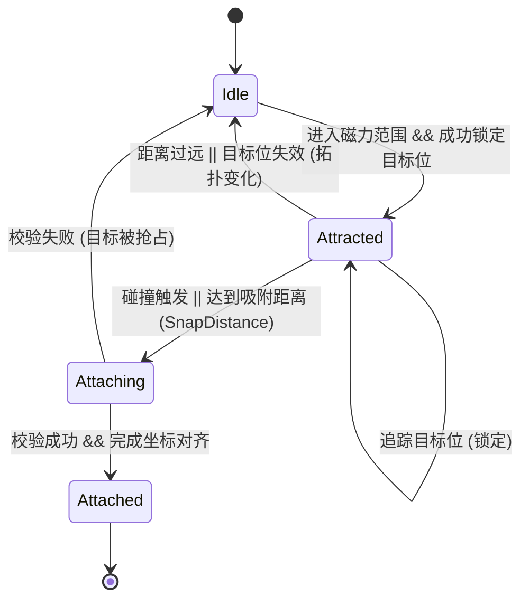

# Fusion Chaos - 2.2 Magnetism and Fusion

## 2.2 磁吸与融合机制 (Magnetism & Fusion)

本系统负责游离方块（CollectableSquare）的物理吸引、占位竞争处理以及最终的网格融合。

当前实现已从 `Player` 单体逻辑重构为模块化架构：

- `GridState`: 网格占位/预约/拓扑版本的唯一事实源。
- `MagnetTargetingService`: 目标格搜索、锁定复用与预约冲突处理。
- `MagnetMotionSystem`: 引力推进、控制环角度对齐、吸附触发判定。
- `AttachPipeline`: 帧级事务挂载流水线（Staging -> 批处理规则检查 -> 原子提交 -> 一致性维护）。
- `MatchEngine` / `ConnectivityEngine`: 消除规则与 BFS 连通性规则。

### 1. 磁吸状态机 (Magnet State Machine)

每个游离方块都维护一个内部状态，确保行为的可预测性：



### 2. 目标锁定与占位机制 (Target Locking & Reservation)

为了解决“多对方一”的抢位冲突和磁吸过程中的剧烈抖动，系统引入了**预约制**：

- **目标搜索**: 由 `MagnetTargetingService` 实时扫描当前集群边缘的空置网格位（Cardinal Neighbors）。
- **预约占用 (`GridState._reservedCells`)**: 
    - 当方块 A 锁定目标位 `(x, y)` 后，该位置会在 `GridState` 的预约表中标记为“已预约”。
    - 其他方块在搜索时会跳过已被预约或已占用的格子。
- **锁定一致性**: 方块一旦锁定目标，除非发生以下情况，否则不会更改目标：
    - 集群拓扑发生变化（`GridState.topologyVersion` 增加）。
    - 锁定超时（`lockTimeoutSeconds`）。
    - 目标位由于某种原因不再合法。

### 3. 引力逻辑与控制环 (Attraction & Control Zone)

- **范围限制**: 仅在 `attractionRadius` (默认 200) 内生效。判定中心为**玩家核心 (Player Core)**。
- **基础漂移 (Base Drift)**: 所有游离方块在全局更新中都会以恒定速度 (`freeDriftSpeed` 默认 30.0) 朝玩家核心移动；磁吸系统在此基础上叠加锁位和吸附行为。
- **环境旋转同步**: 场景中所有**游离方块**的角位置通过全局变量 `worldRotation` 受陀螺仪控制。
- **控制环概念 (The Control Zone)**:
    - **自由吸引区 (Outer Zone)**: 环外的方块受引力影响，径向飞向玩家。
    - **平滑引导区 (Control Ring)**: 当方块进入 `controlRadius`（与 `attractionRadius` 同步）后，系统会施加额外的**轨道引导力 (Orbital Alignment)**。
- **力场计算 (Velocity-based)**:
    - 系统采用基于速度叠加的物理模拟，而非硬性的位置插值。
    - **轨道引导 (Orbital Alignment)**: 将方块引导至其锁定目标槽位所在的放射线上。
    - **径向吸引 (Radial Attraction)**: 将方块拉向目标槽位的中心。
    - **强度衰减**: `Strength = 1 - (DistanceToCore / Radius)`。
- **角度同步 (Rotation Alignment)**: 
    - 方块的自身角度会平滑对齐到玩家当前的旋转角度，取消了硬性的 $90^\circ$ 步进感。

### 4. 融合与网格对齐 (Fusion & Grid Alignment)

当吸附发生时，系统执行严格的逻辑校验与坐标修正。为了防止“幽灵方块”现象（方块刚吸附就被消除但仍在视觉上停留一帧），系统采用**帧级事务处理 (Frame-Level Transaction)**：

- **吸附触发**:
    - **物理碰撞**: `onCollisionStart` 触发吸附请求。
    - **距离吸附**: 距离目标格中心小于 `snapDistance` (默认 6.0) 时自动吸附。
- **帧级事务流水线 (The Pipeline)**:
    1. **暂存 (Staging)**: 本帧内所有触发吸附的方块先通过 `stageAttach` 写入 `GridState` 占位，并进入待处理队列。
    2. **快照一致性**: 在帧末 `flush` 阶段，系统对当前网格状态取统一快照。
    3. **批量规则检查**: 在快照上运行 `MatchEngine` 发现匹配，随后在移除匹配后的状态上运行 `ConnectivityEngine` 发现孤立 (Orphan)。
    4. **原子提交**: 
        - 移除所有匹配和孤立位，并触发相应的世界重新挂载。
        - 仅对存活下来的暂存方块执行真正的父组件转移（`moveUnderPlayer`）与对齐。
    5. **一致性检查 (Invariants)**: 事务结束前，执行 `validateAndRepair` 确保 `GridState` 内部集合严格同步，清理无效预约。
- **对齐规则**: 
    - 融合后的方块成为 `Player` 的子组件。
    - 局部坐标 `LocalPos = (gridX * 20 + 10, gridY * 20 + 10)`（基于 `Anchor.center`）。
    - **强制对齐**: 在挂载瞬间，局部角度被强制对齐到最近的 $90^\circ$ 倍数。
- **平滑过渡 (视觉连续性)**:
    - 系统在转移父组件的前后严格保持世界坐标一致，使用 `square.pendingLocalPosition` 在下一帧应用对齐。

### 5. 处理策略与性能 (Processing Strategy & Performance)

当前版本为了优先保证稳定性，采用“全量候选 + 全量处理”策略；历史优化项保留为可回切能力：

- **Vector 池化 (Reuse)**: 在 `update` 循环中使用预分配的临时向量（如 `_tempVec1`），减少临时对象分配。
- **网格局部缓存**: 缓存 `_cellToLocal` 的计算结果，避免重复网格到局部坐标转换。
- **游离集合检索**: 使用 `FusionGame` 维护的游离集合进行候选检索，并在更新中轻量去污。
- **全量候选刷新**: 当前默认 `candidateRefreshInterval = 0.0`，每帧刷新候选人。
- **全量磁吸处理**: 当前默认对全部候选方块执行磁吸推进（不再按批次截断）。
- **预约清理**: 候选集合变化时，清理掉离开候选集方块的预约与锁定，避免预约泄漏导致的“仅漂移不磁吸”。

### 6. 消除逻辑 (Matching Logic)

不再依赖颜色，而是依赖**形状排布**进行消除。

- **核心排除规则**: 玩家核心 `(0,0)` **不参与**形状匹配，且作为匹配路径的**阻断物**。
- **消除规则 (Match Rules)**:
    - **五连珠 (Match 5)**: 任意 5 个连续占用的网格位（不含核心且不被核心中断）连成一条直线（横向或纵向）。
        - *示例 1 (不触发)*: `[] [] [Core] [] []`（被核心阻断，路径不连续）。
        - *示例 2 (触发)*: `[] [] [Core] [] [] [] [] []`（右侧 5 个方块连续且不含核心，触发消除）。
        - *消除后状态*: `[] [] [Core]`。
    - **金字塔 (Match Pyramid 5-3-1)**: 9 个连续占用的网格位（不含核心）排列成 5-3-1 的金字塔结构（支持 4 个朝向）。
    - **大方块 (Match Square 3x3)**: 任意 3x3 的连续占用网格区域（不含核心，即 9 个方块）。
- **执行时机**: 统一集成在 `AttachPipeline.flush` 事务中。在每一帧的所有吸附请求处理完毕后，系统在统一的快照上运行规则检查，确保被消除的方块不会产生任何一帧的视觉残留，且连锁反应（消除导致孤立）在单帧内完成。

### 7. 连通性检查与断开逻辑 (Connectivity & Disconnection)

当方块被消除后，剩下的方块丛可能产生“悬空”部分。

- **连通性校验 (BFS Check)**:
    - 每一帧的 `flush` 事务中，在移除匹配方块后的网格快照上，系统以玩家核心 `(0,0)` 为起点进行广度优先搜索 (BFS)。
    - 标记所有能通过邻接关系到达核心的方块。
- **断开与坐标保持 (Orphan Detachment & Re-attraction)**:
    - 任何未被标记的方块判定为“孤立 (Orphaned)”。
    - **世界坐标保持**: 在脱离 `Player` 瞬间，系统记录其当前的**绝对世界坐标和角度**。
    - 孤立方块被重新加入 `game.world` 并应用记录的坐标，确保其在屏幕上保持原位不动，而不是跳变到核心附近。
    - 随后它们重置为游离状态（`MagnetState.idle`），再次受全局漂移和引力影响。

### 8. 调试面板 (Debug Panel)

为了方便实时调整游戏参数，系统在右上角集成了一个可折叠的调试面板：

- **入口**: 屏幕右上角的 "Show Debug" 按钮。
- **生成设置 (Spawn Settings)**: 调整游离方块的生成速率与数量。
- **视觉效果 (Visual Effects)**: 
    - **显示引力线 (`Show Lines`)**: 开启/关闭引力视觉引导。
    - **显示脉冲 (`Show Pulses`)**: 开启/关闭连接时的冲击波效果。
    - **引力风格 (`Gravity Style`)**: 切换不同的引力线渲染模式。
- **消除规则 (Elimination Rules)**: 
    - **规则开关 (`enabledRules`)**: 允许通过勾选框实时开启/关闭特定的消除规则（Match 5, Pyramid 5-3-1, Square 3x3）。
- **镜头设置 (Camera Settings)**: 调整自动缩放行为。
    - **自动缩放开关 (`enableAutoZoom`)**: 启用/禁用基于质量的缩放。
    - **灵敏度 (`zoomSensitivity`)**: 控制缩放随质量变化的剧烈程度（0.0 - 1.0）。
    - **最小缩放 (`minZoom`)**: 限制镜头拉到最远的程度（0.05 - 0.5）。
    - **缩放速度 (`zoomSpeed`)**: 镜头跟随质量变化的反应速度（0.5 - 10.0）。
- **实现方式**: 
    - 使用 Flutter Overlay (`DebugPanel`) 与 `GameWidget` 集成。
    - 动态修改 `Player` 或 `FusionGame` 实例中的参数，实时影响每帧的计算。

### 9. 操作控制 (Controls)

- **旋转 (环境)**: 
    - `Q` / `,` (逗号): 逆时针旋转环境。
    - `E` / `.` (句号): 顺时针旋转环境。

### 10. 核心对齐示意图 (ASCII)

```text
    [ ] - 占位方块
    (C) - 玩家核心 (0,0)
    [T] - 锁定目标位 (TargetCell)
    ---> - 引力方向

          [ ]
           |
    [ ]---(C)---[T] <--- [Square]
           |
          [ ]
```

### 11. 集群边界计算示意图 (AABB)

```text
    MinX, MinY
    +-----------+
    | [ ][ ]    |
    | [ ](C)[ ] |
    |       [ ] |
    +-----------+
              MaxX, MaxY
    
    ClusterBounds = Rect(MinX, MinY, MaxX, MaxY)
    ```

### 12. 连锁稳定性回归场景 (Chain Stability & Regression)

为了防止“orphan 呆在原地不动”或数据结构 desync 再次发生，重构后的系统必须通过以下逻辑回归：

1. **瞬时连锁消除**: 方块 A 吸附导致横向消除，消除后导致上方方块 B 孤立。系统必须在同一帧内完成 A 的挂载失败逻辑和 B 的脱离逻辑。
2. **孤立再吸附 (Orphan Re-attraction)**: 方块被脱离后，其 `GridState` 预约和 `CollectableSquare` 锁必须立即清理，使其在 1-2 帧内能被重新锁位。
3. **过期锁防御**: 当玩家旋转或拓扑剧烈变化时，残留的 `lockedTargetCell` 若不再合法，必须由 `Player` 磁吸循环防御性清理，不得阻塞新预约。
4. **一致性守卫**: 任何原因导致的 `_occupiedCells` 与 `_attachedSquares` 不同步，必须在帧末被 `validateAndRepair` 自动修正。
