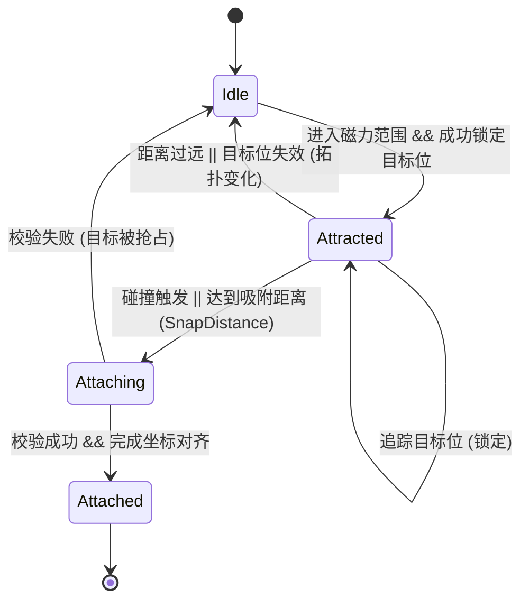

# Fusion Chaos - 2.2 Magnetism and Fusion

## 2.2 磁吸与融合机制 (Magnetism & Fusion)

本系统负责游离方块（CollectableSquare）的物理吸引、占位竞争处理以及最终的网格融合。

### 1. 磁吸状态机 (Magnet State Machine)

每个游离方块都维护一个内部状态，确保行为的可预测性：



### 2. 目标锁定与占位机制 (Target Locking & Reservation)

为了解决“多对方一”的抢位冲突和磁吸过程中的剧烈抖动，系统引入了**预约制**：

- **目标搜索**: 玩家（Player）实时扫描当前集群边缘的空置网格位（Cardinal Neighbors）。
- **预约占用 (`_reservedCells`)**: 
    - 当方块 A 锁定目标位 `(x, y)` 后，该位置会在 `Player` 的预约表中标记为“已预约”。
    - 其他方块在搜索时会跳过已被预约或已占用的格子。
- **锁定一致性**: 方块一旦锁定目标，除非发生以下情况，否则不会更改目标：
    - 集群拓扑发生变化（`topologyVersion` 增加）。
    - 锁定超时（`lockTimeoutSeconds`）。
    - 目标位由于某种原因不再合法。

### 3. 引力逻辑 (Attraction Physics)

- **范围限制**: 仅在 `attractionRadius` (默认 150) 内生效。
- **力场计算**:
    - 引力方向：指向锁定目标格的**中心点**（World Position）。
    - 引力强度：`Strength = (1 - Distance / Radius) * AttractionForce`。
    - 线性衰减确保了方块越接近目标速度越快，产生强烈的“被吸入”感。

### 4. 融合与网格对齐 (Fusion & Grid Alignment)

当吸附发生时，系统执行严格的坐标修正：

- **吸附触发**:
    - **物理碰撞**: `onCollisionStart` 触发吸附请求。
    - **距离吸附**: 距离目标格中心小于 `snapDistance` (默认 6.0) 时自动吸附。
- **最终校验**: 在正式融合前，`Player` 会进行二次检查，确保目标位依然满足“四邻接且未占用”的硬约束。
- **对齐规则**: 
    - 融合后的方块成为 `Player` 的子组件。
    - 局部坐标 `LocalPos = (gridX * 20 + 10, gridY * 20 + 10)`（基于 `Anchor.center`）。
    - 确保所有块严格对齐 20x20 网格。
- **平滑过渡 (视觉连续性)**:
    - 为了避免在更换父组件（从 `World` 到 `Player`）时产生单帧坐标跳变（闪烁），系统采用“预设坐标”机制：
        - 在转移父组件的那一帧，先计算其在 `Player` 坐标系下的目标局部位置。
        - 设置 `square.pendingLocalPosition` 为该目标局部位置。
        - 同时暂时将 `square.position` 设置为对应的**世界坐标**，确保其在当前帧（仍为 `World` 子组件时）显示位置正确。
        - 在下一帧组件挂载到 `Player` 后，`onMount` 会自动将 `position` 应用为 `pendingLocalPosition`。

### 5. 性能优化方案 (Performance Optimization)

由于场景中可能存在大量游离方块，磁吸逻辑采用了多重优化策略：

- **空间感知的候选人检索**: 利用区块（Chunk）系统，仅检索玩家周围活跃区块内的方块，避免全量扫描场景。
- **边缘范围预过滤**: 在刷新候选人列表时，先基于当前集群外环候选格（Attach Candidates）计算世界坐标 AABB，再按 `attractionRadius` 扩张该包围盒，仅保留处于该范围内的方块。
    - **可见区域过滤**: 在边缘范围预过滤后，再使用摄像机可见世界区域 + `visibleCandidateMargin` 做二次过滤，优先把每帧预算用于屏幕内（及边缘缓冲区）目标。
    - **优先级排序**: 候选人列表按距离平方升序排列，确保在方块数量超过 `magnetBatchSize` 时，离玩家最近的方块能获得优先的引力计算，避免吸附感在远近目标间闪烁。
    - **自适应视野 (Camera Zoom)**: 动态镜头缩放不仅是视觉增强，也间接扩展了过滤系统的“有效窗口”，配合 `activeRadius` 的提升，在大体量阶段保持操作空间的合理性。
- **批次更新**: 每帧仅处理固定数量 (`magnetBatchSize`) 的方块进行引力计算。
- **候选人缓存**: 默认每隔 0.2s (`candidateRefreshInterval`) 刷新一次活跃方块列表。

### 6. 动态镜头缩放 (Dynamic Camera Zoom)

随着玩家集群的增长，系统会自动调整摄像机缩放比例，以维持视觉上的平衡并提供更广阔的视野。

- **触发机制**: 每帧基于玩家当前的集群物理边界 (`clusterBounds`) 计算目标缩放值。
- **缩放计算**:
    - 使用非线性映射：`TargetZoom = pow(InitialSize / CurrentClusterSize, ZoomSensitivity)`。
    - `ZoomSensitivity`: 缩放灵敏度（0.0 - 1.0，默认 0.15），值越高缩放效果越明显。
    - 缩放范围由 `minZoom` 和 `maxZoom` 严格限制。
- **平滑过渡**: 采用线性插值平滑缩放变化：`currentZoom += (targetZoom - currentZoom) * zoomSpeed * dt`。
- **关联影响**: 
    - 随着镜头拉远，玩家视野增大。
    - 为配合大视野，区块系统的活跃半径 (`activeRadius`) 会相应增加，确保远处的方块也能正常生成和显示。

### 7. 调试面板 (Debug Panel)

为了方便实时调整磁吸参数，系统在右上角集成了一个可折叠的调试面板：

- **入口**: 屏幕右上角的 "Show Debug" 按钮。
- **磁吸设置 (Magnetism Settings)**: 点击标题可展开/折叠。
    - **吸附半径 (`attractionRadius`)**: 控制引力场覆盖的范围（0 - 500）。
    - **吸附力度 (`attractionForce`)**: 控制引力的基础强度（0 - 2000）。
    - **批次大小 (`magnetBatchSize`)**: 每帧处理的最大方块数（1 - 100）。
    - **刷新间隔 (`candidateRefreshInterval`)**: 候选人列表的更新频率（0.01s - 1.0s）。
    - **可见过滤开关 (`enableVisibleCandidateFilter`)**: 控制是否仅处理屏幕可见区域（含边距）内的候选方块。
    - **可见边距 (`visibleCandidateMargin`)**: 扩张可见区域的缓冲距离，减少屏幕边缘吸附突变（0 - 300）。
- **镜头设置 (Camera Settings)**: 调整自动缩放行为。
    - **自动缩放开关 (`enableAutoZoom`)**: 启用/禁用基于质量的缩放。
    - **灵敏度 (`zoomSensitivity`)**: 控制缩放随质量变化的剧烈程度（0.0 - 1.0）。
    - **最小缩放 (`minZoom`)**: 限制镜头拉到最远的程度（0.05 - 0.5）。
    - **缩放速度 (`zoomSpeed`)**: 镜头跟随质量变化的反应速度（0.5 - 10.0）。
- **实现方式**: 
    - 使用 Flutter Overlay (`DebugPanel`) 与 `GameWidget` 集成。
    - 动态修改 `Player` 或 `FusionGame` 实例中的参数，实时影响每帧的计算。

### 8. 核心对齐示意图 (ASCII)

```text
    [ ] - 占位方块
    (C) - 玩家核心 (0,0)
    [T] - 锁定目标位 (TargetCell)
    ---> - 引力方向

          [ ]
           |
    [ ]---(C)---[T] <--- [Square]
           |
          [ ]
```

### 8. 集群边界计算示意图 (AABB)

```text
    MinX, MinY
    +-----------+
    | [ ][ ]    |
    | [ ](C)[ ] |
    |       [ ] |
    +-----------+
              MaxX, MaxY
    
    ClusterBounds = Rect(MinX, MinY, MaxX, MaxY)
```
