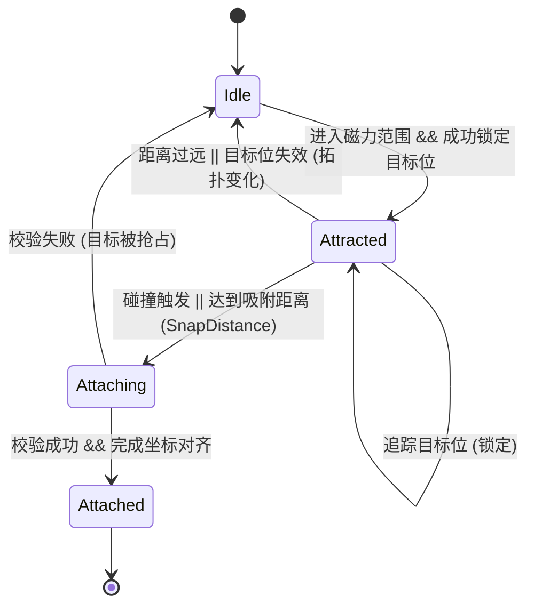

# Fusion Chaos - 2.2 Magnetism and Fusion

## 2.2 磁吸与融合机制 (Magnetism & Fusion)

本系统负责游离方块（CollectableSquare）的物理吸引、占位竞争处理以及最终的网格融合。

### 1. 磁吸状态机 (Magnet State Machine)

每个游离方块都维护一个内部状态，确保行为的可预测性：



### 2. 目标锁定与占位机制 (Target Locking & Reservation)

为了解决“多对方一”的抢位冲突和磁吸过程中的剧烈抖动，系统引入了**预约制**：

- **目标搜索**: 玩家（Player）实时扫描当前集群边缘的空置网格位（Cardinal Neighbors）。
- **预约占用 (`_reservedCells`)**: 
    - 当方块 A 锁定目标位 `(x, y)` 后，该位置会在 `Player` 的预约表中标记为“已预约”。
    - 其他方块在搜索时会跳过已被预约或已占用的格子。
- **锁定一致性**: 方块一旦锁定目标，除非发生以下情况，否则不会更改目标：
    - 集群拓扑发生变化（`topologyVersion` 增加）。
    - 锁定超时（`lockTimeoutSeconds`）。
    - 目标位由于某种原因不再合法。

### 3. 引力逻辑与控制环 (Attraction & Control Zone)

- **范围限制**: 仅在 `attractionRadius` (默认 150) 内生效。
- **基础漂移 (Base Drift)**: 所有游离方块在全局更新中都会以恒定缓慢速度朝玩家核心移动；磁吸系统在此基础上叠加锁位和吸附行为。
- **环境旋转同步**: 场景中所有**游离方块**的角位置通过全局变量 `worldRotation` 受陀螺仪控制。
- **控制环概念 (The Control Zone)**:
    - **自由吸引区 (Outer Zone)**: 环外的方块受引力影响，径向飞向玩家。
    - **精准对齐区 (Control Ring)**: 当方块进入特定半径（`controlRadius`）后，其相对于玩家的角位置被 `worldRotation` 强制同步。当前实现中 `controlRadius` 与 `attractionRadius` 保持一致。
- **力场计算**:
    - 引力方向：指向锁定目标格在当前旋转状态下的**世界中心点**。
    - 引力强度：`Strength = (1 - Distance / Radius) * AttractionForce`。
- **角度同步 (Rotation Snapping)**: 
    - 方块的自身角度会向最接近的玩家 $90^\circ$ 增量角度平滑插值，确保吸附时严格对齐。

### 4. 融合与网格对齐 (Fusion & Grid Alignment)

当吸附发生时，系统执行严格的坐标与角度修正：

- **吸附触发**:
    - **物理碰撞**: `onCollisionStart` 触发吸附请求。
    - **距离吸附**: 距离目标格中心小于 `snapDistance` (默认 6.0) 时自动吸附。
- **最终校验**: 在正式融合前，`Player` 会进行二次检查，确保目标位依然满足“四邻接且未占用”的硬约束。
- **对齐规则**: 
    - 融合后的方块成为 `Player` 的子组件。
    - 局部坐标 `LocalPos = (gridX * 20 + 10, gridY * 20 + 10)`（基于 `Anchor.center`）。
    - 局部角度设为最近的 $90^\circ$ 倍数（相对于 `Player` 坐标系），确保所有块严格对齐 20x20 网格，且面面相贴，即使它们的纹理或原始朝向可能不同。
- **平滑过渡 (视觉连续性)**:
    - 为了避免在更换父组件（从 `World` 到 `Player`）时产生单帧坐标或角度跳变，系统采用“预设属性”机制：
        - 在转移父组件的那一帧，先计算其在 `Player` 局部坐标系下的目标位置和角度。
        - 设置 `square.pendingLocalPosition` 和 `square.pendingLocalAngle`。
        - 同时暂时将 `square.position` 设置为对应的**世界坐标**，确保其在当前帧显示位置正确。
        - 在下一帧组件挂载到 `Player` 后，`onMount` 会自动应用这些预设属性。

### 5. 性能优化方案 (Performance Optimization)

由于场景中可能存在大量游离方块，磁吸逻辑针对 Web 端进行了深度优化：

- **Vector 池化 (Reuse)**: 在 `update` 循环中使用预分配的临时向量（如 `_tempVec1`），避免每帧产生大量 `Vector2` 实例，减轻垃圾回收（GC）压力。
- **网格局部缓存**: 缓存 `_cellToLocal` 的计算结果，避免重复进行网格到局部坐标的转换。
- **游离集合检索**: 使用游离方块集合进行候选检索，并在更新中做轻量去污，减少无效对象带来的额外计算。
- **旋转补偿的包围盒过滤**: 在计算候选人过滤范围时，考虑集群的旋转 AABB，确保在高速旋转下也能准确过滤。
- **批次更新**: 每帧仅处理固定数量 (`magnetBatchSize`) 的方块进行引力计算。
- **候选人缓存**: 默认每隔 0.2s 刷新一次活跃方块列表。

### 6. 消除逻辑 (Matching Logic)

不再依赖颜色，而是依赖**形状排布**进行消除。玩家核心 `(0,0)` 不参与匹配且不可被消除。

- **消除规则 (Match Rules)**:
    - **五连珠 (Match 5)**: 任意 5 个方块在网格上连成一条直线（横向或纵向）。
    - **金字塔 (Match Pyramid)**: 6 个方块排列成 1-2-3 的金字塔结构（支持 4 个朝向）。
- **执行时机**: 每次方块成功挂载到玩家集群后触发。

### 7. 连通性检查与断开逻辑 (Connectivity & Disconnection)

当方块被消除后，剩下的方块丛可能产生“悬空”部分。

- **连通性校验 (BFS Check)**:
    - 每次消除行为完成后，系统以玩家核心 `(0,0)` 为起点进行广度优先搜索 (BFS)。
    - 标记所有能通过邻接关系到达核心的方块。
- **断开与重新吸引 (Orphan Re-attraction)**:
    - 任何未被标记（无法到达核心）的方块被判定为“孤立 (Orphaned)”。
    - 孤立方块将从玩家组件中脱离，重新变回游离状态（`MagnetState.idle`）。
    - 它们会再次获得物理属性，并受引力影响重新被玩家吸引。

### 8. 调试面板 (Debug Panel)

为了方便实时调整磁吸参数，系统在右上角集成了一个可折叠的调试面板：

- **入口**: 屏幕右上角的 "Show Debug" 按钮。
- **磁吸设置 (Magnetism Settings)**: 点击标题可展开/折叠。
    - **吸附半径 (`attractionRadius`)**: 控制引力场覆盖的范围（0 - 500）。
    - **吸附力度 (`attractionForce`)**: 控制引力的基础强度（0 - 2000）。
    - **批次大小 (`magnetBatchSize`)**: 每帧处理的最大方块数（1 - 100）。
    - **刷新间隔 (`candidateRefreshInterval`)**: 候选人列表的更新频率（0.01s - 1.0s）。
    - **可见过滤开关 (`enableVisibleCandidateFilter`)**: 控制是否仅处理屏幕可见区域（含边距）内的候选方块。
    - **可见边距 (`visibleCandidateMargin`)**: 扩张可见区域的缓冲距离，减少屏幕边缘吸附突变（0 - 300）。
- **镜头设置 (Camera Settings)**: 调整自动缩放行为。
    - **自动缩放开关 (`enableAutoZoom`)**: 启用/禁用基于质量的缩放。
    - **灵敏度 (`zoomSensitivity`)**: 控制缩放随质量变化的剧烈程度（0.0 - 1.0）。
    - **最小缩放 (`minZoom`)**: 限制镜头拉到最远的程度（0.05 - 0.5）。
    - **缩放速度 (`zoomSpeed`)**: 镜头跟随质量变化的反应速度（0.5 - 10.0）。
- **实现方式**: 
    - 使用 Flutter Overlay (`DebugPanel`) 与 `GameWidget` 集成。
    - 动态修改 `Player` 或 `FusionGame` 实例中的参数，实时影响每帧的计算。

### 9. 操作控制 (Controls)

- **旋转 (环境)**: 
    - `Q` / `,` (逗号): 逆时针旋转环境。
    - `E` / `.` (句号): 顺时针旋转环境。

### 10. 核心对齐示意图 (ASCII)

```text
    [ ] - 占位方块
    (C) - 玩家核心 (0,0)
    [T] - 锁定目标位 (TargetCell)
    ---> - 引力方向

          [ ]
           |
    [ ]---(C)---[T] <--- [Square]
           |
          [ ]
```

### 11. 集群边界计算示意图 (AABB)

```text
    MinX, MinY
    +-----------+
    | [ ][ ]    |
    | [ ](C)[ ] |
    |       [ ] |
    +-----------+
              MaxX, MaxY
    
    ClusterBounds = Rect(MinX, MinY, MaxX, MaxY)
```
