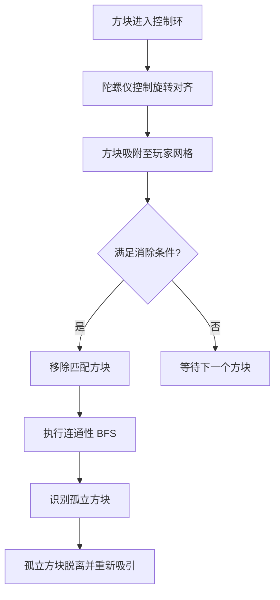

# Fusion Mobile - 4.0 Mobile Gyro Design

## 4.0 移动端陀螺仪与节奏消除设计 (Mobile Gyro & Rhythm Match Design)

为了优化移动端体验，游戏引入了基于陀螺仪的交互机制，并将核心玩法转向“节奏消除”。

### 1. 陀螺仪环境旋转 (Gyroscope Environment Rotation)

与传统的旋转玩家方块丛不同，移动端版本将旋转目标从“玩家”转移到了“环境”。

- **玩家状态 (Player State)**: 玩家方块丛的角度保持锁定（始终相对于屏幕正向），不再受手动旋转控制。
- **环境旋转 (World Rotation)**: 通过手机陀螺仪（Gyroscope）控制场景中所有**游离方块**的角位置。
- **交互逻辑**: 
    - 玩家旋转手机时，屏幕上的游离方块会绕着玩家中心同步旋转。
    - 这种设计让玩家感觉自己是在转动一个“外部圆盘”，通过对准挂载点来接住飞来的方块。
- **技术实现**:
    - 使用 `sensors_plus` 插件监听陀螺仪变化。
    - 维护一个全局变量 `worldRotation`。
    - 未挂载方块在 `update` 时，其引力目标位的计算会叠加上这个旋转偏移。

### 2. 控制环概念 (The Control Zone)

在玩家周围引入一个视觉化的“控制环”。

- **区域划分**:
    - **自由吸引区 (Outer Zone)**: 环外的方块受引力影响，径向飞向玩家。
    - **精准对齐区 (Control Ring)**: 当方块进入特定半径（Control Radius）后，其相对于玩家的角位置被陀螺仪产生的 `worldRotation` 强制同步。
- **操作感**: 玩家通过旋转手机来“微调”控制环内方块的方位，使其精准落入预期的网格位置。

### 3. 消除逻辑 (Matching Logic)

游戏视觉风格保持纯黑白，不再依赖颜色，而是依赖**形状排布**进行消除。

- **消除规则 (Match Rules)**:
    - **五连珠 (Match 5)**: 任意 5 个同色（当前为全白或全黑）方块在网格上连成一条直线（横向或纵向）。
    - **金字塔 (Match Pyramid)**: 6 个方块排列成 1-2-3 的金字塔结构。
- **视觉风格**:
    - 整体仅使用黑色 (Black) 和白色 (White)。
    - 背景通常为黑，玩家与方块为白（或交替）。

### 4. 连通性检查与断开逻辑 (Connectivity & Disconnection)

当方块被消除后，剩下的方块丛可能产生“悬空”部分。

- **连通性校验 (BFS Check)**:
    - 每次消除行为完成后，系统以玩家核心 `(0,0)` 为起点进行广度优先搜索 (BFS)。
    - 标记所有能通过邻接关系到达核心的方块。
- **断开与重新吸引 (Orphan Re-attraction)**:
    - 任何未被标记（无法到达核心）的方块被判定为“孤立 (Orphaned)”。
    - 孤立方块将从玩家组件中脱离，重新变回游离状态。
    - 它们会再次获得物理属性，并受引力影响重新被玩家吸引。

### 5. 游戏流程图 (Flowchart)

